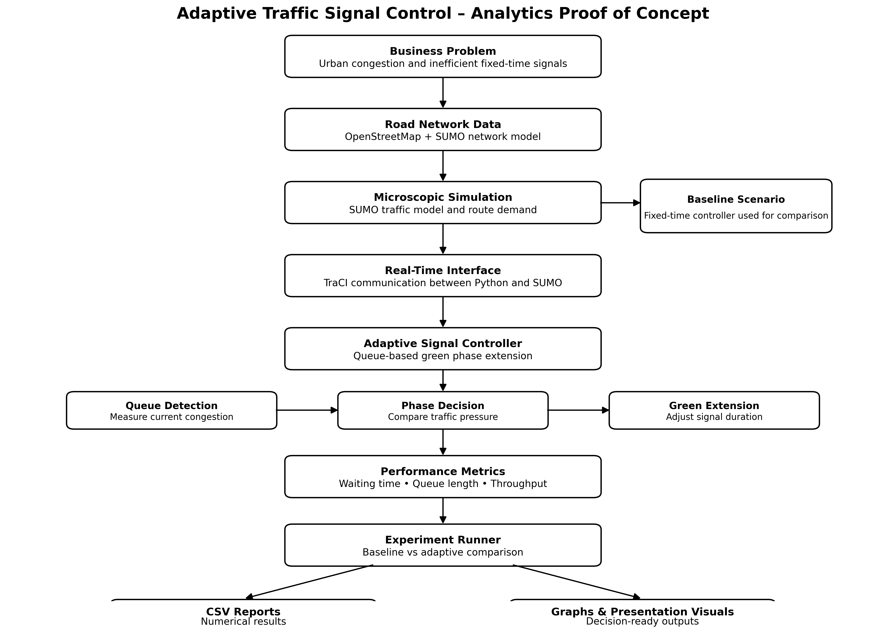
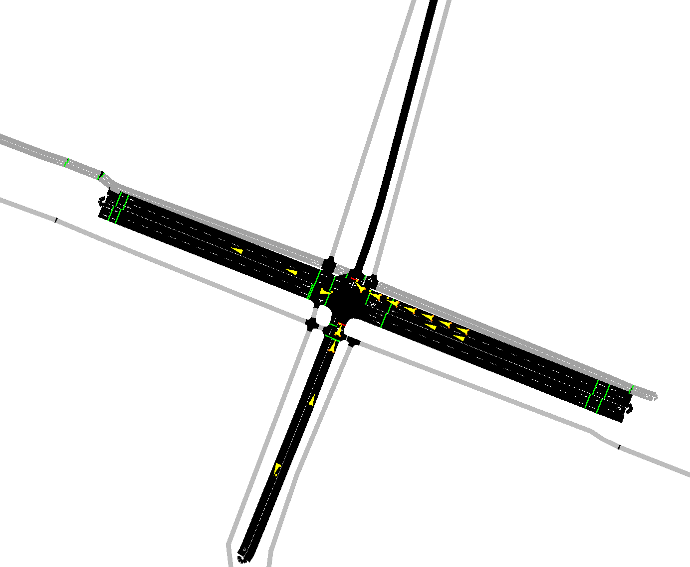
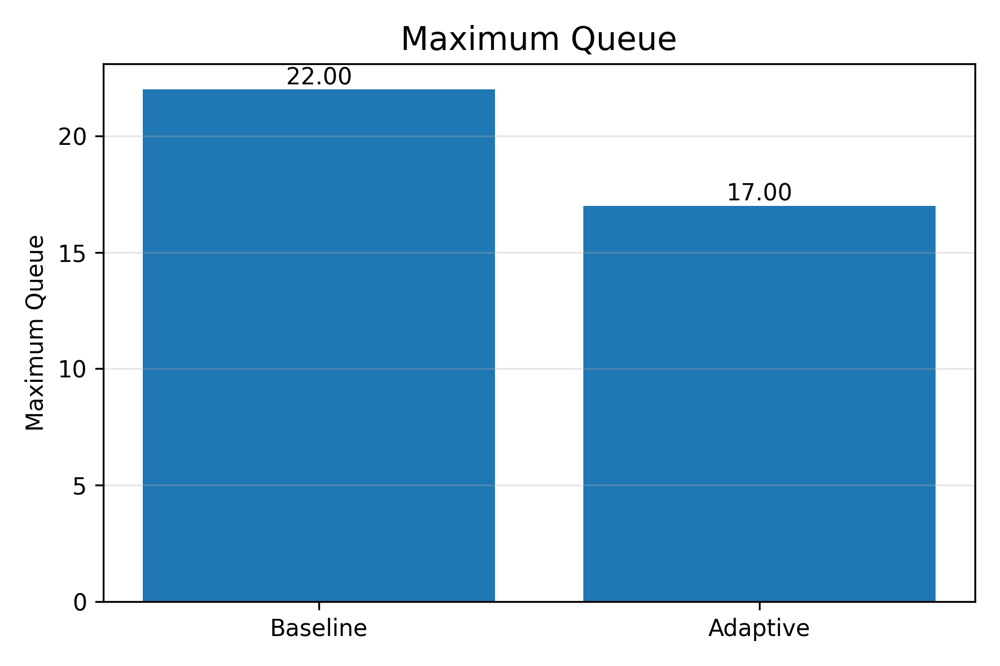
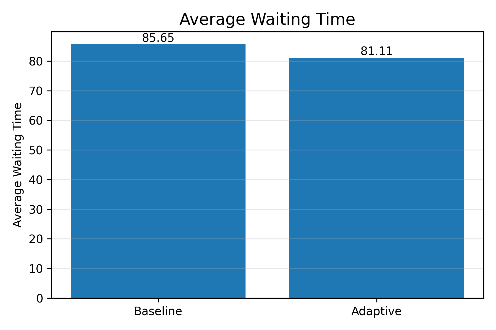

# 🚦 Adaptive Traffic Control using SUMO

MSBA Capstone Project  
Quantic School of Business and Technology

A Python-based adaptive traffic signal controller developed using **SUMO (Simulation of Urban MObility)** and **TraCI** to evaluate whether real-time queue-based traffic signal control can improve intersection performance compared with traditional fixed-time traffic lights.

This project was developed as part of the **Master of Science in Business Analytics (MSBA) Capstone Project**.

| Category | Value |
|----------|-------|
| Language | Python |
| Simulation | SUMO |
| Interface | TraCI |
| Network | OpenStreetMap |
| Project | MSBA Capstone |
| License | MIT |

---

# Project Overview

Urban traffic congestion is one of the major challenges faced by modern cities. Traditional fixed-time traffic lights cannot react to changing traffic demand, often causing unnecessary waiting times and long vehicle queues.

This project proposes an adaptive traffic signal controller that continuously monitors traffic conditions and dynamically adjusts green phase duration according to current queue lengths.

The controller is evaluated against a traditional fixed-time controller using microscopic traffic simulation.

## Key Achievements

✔ Adaptive queue-based traffic signal controller

✔ 5.29% reduction in average waiting time

✔ 22.73% reduction in maximum queue length

✔ Automatic experiment framework

✔ CSV export and graph generation

---

# Features

- Adaptive traffic signal controller
- Fixed-time baseline controller
- Automatic queue detection
- Dynamic green phase extension
- Automatic experiment runner
- Traffic performance metrics collection
- CSV export
- Automatic graph generation
- Modular Python architecture

---

# Technologies

- Python
- SUMO
- TraCI
- OpenStreetMap
- Matplotlib
- NumPy
- Pandas

---

# Repository Structure

```
controllers/
    adaptive_controller.py

simulation/
    baseline_simulation.py
    adaptive_simulation.py
    experiment_runner.py
    simulation_result.py

metrics/
    traffic_metrics.py
    result_exporter.py
    result_plotter.py

network/
    network.net.xml
    project.sumocfg

tests/
    test_baseline.py
    test_adaptive.py

docs/
    images/

README.md
```

---

# System Architecture



---

# Running the Project

## 1. Clone the repository

```bash
git clone https://github.com/zrupcic/AdaptiveTrafficControl.git
```

## 2. Install dependencies

```bash
pip install -r requirements.txt
```

## 3. Configure SUMO

Make sure SUMO is installed and available in your system PATH.

## 4. Run the baseline simulation

```bash
python simulation/baseline_simulation.py
```

## 5. Run the adaptive simulation

```bash
python simulation/adaptive_simulation.py
```

## 6. Run the experiment

```bash
python simulation/experiment_runner.py
```

---

# SUMO Simulation



# Results

The adaptive controller was evaluated against a traditional fixed-time controller.

| Metric | Baseline | Adaptive | Improvement |
|----------|---------:|---------:|------------:|
| Throughput | 1200 | 1200 | 0% |
| Average Queue | 5.76 | 5.57 | 3.22% |
| Maximum Queue | 22 | 17 | 22.73% |
| Average Waiting | 85.65 s | 81.11 s | 5.29% |

The adaptive controller reduced average waiting time and queue lengths while maintaining identical throughput.

---

# Example Output

## Maximum Queue



## Average Waiting



---

# Future Work

Potential extensions include:

- Multiple intersection coordination
- Reinforcement learning
- Machine learning traffic prediction
- Emergency vehicle priority
- Public transport prioritisation
- Real-world detector integration
- City-wide deployment

---

# Authors

**Zdenko Rupčić**

Project Lead / Technical Feasibility Lead

LinkedIn: https://www.linkedin.com/in/zdenko-rupcic/

**Jessy Fong**

Analytics and Business Value Lead

---

# License

This project is released under the MIT License.
